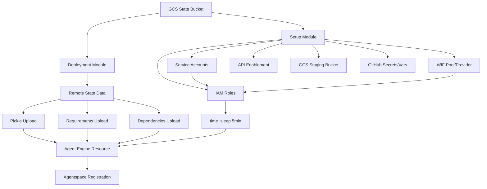

# Technical Specification: Terraform-Based Agent Engine Deployment Migration

**Date:** 2025-10-09
**Project:** agent-engine-cicd-base
**Migration Goal:** Replace Python-based Agent Engine deployment with Terraform `google_vertex_ai_reasoning_engine` resource

---

## 1. Architectural Design

### 1.1 Complete Directory Structure

#### Current Structure
```
agent-engine-cicd-base/
├── terraform/                  # Monolithic Terraform config
│   ├── github.tf              # GitHub secrets/variables
│   ├── iam.tf                 # Service accounts, IAM, WIF
│   ├── services.tf            # API enablement
│   ├── locals.tf              # Local variables from .env
│   ├── variables.tf           # Input variables
│   ├── outputs.tf             # Output values
│   ├── providers.tf           # Provider configuration
│   └── terraform.tf           # Terraform version constraints
├── src/deployment/             # Python deployment scripts
│   ├── deploy_agent.py        # Agent Engine deployment
│   └── register_agent.py      # Agentspace registration
└── .github/workflows/
    └── deploy-to-agent-engine.yaml  # GitHub Actions workflow
```

#### Proposed Structure
```
agent-engine-cicd-base/
├── terraform/
│   ├── setup/                 # One-time CI/CD infrastructure
│   │   ├── main.tf           # Resource organization
│   │   ├── backend.tf        # GCS remote state backend
│   │   ├── github.tf         # GitHub secrets/variables
│   │   ├── iam.tf            # Service accounts, IAM, WIF
│   │   ├── services.tf       # API enablement
│   │   ├── storage.tf        # GCS staging bucket (NEW)
│   │   ├── locals.tf         # Local variables from .env
│   │   ├── variables.tf      # Input variables
│   │   ├── outputs.tf        # Exported values for deployment
│   │   ├── providers.tf      # Provider configuration
│   │   └── README.md         # Setup module documentation
│   │
│   └── deployment/            # Per-deployment Agent Engine
│       ├── main.tf           # Agent Engine resource (NEW)
│       ├── backend.tf        # GCS remote state backend
│       ├── data.tf           # Remote state and GCS data sources
│       ├── packaging.tf      # Pickle/dependency packaging (NEW)
│       ├── variables.tf      # Deployment-specific variables
│       ├── outputs.tf        # Agent Engine ID and metadata
│       ├── providers.tf      # Provider configuration
│       └── README.md         # Deployment module documentation
├── scripts/                    # Support scripts (NEW)
│   ├── create_pickle.py      # Generate pickle from agent
│   └── prepare_artifacts.sh  # Package preparation script
├── src/deployment/            # Retained for development
│   ├── deploy_agent.py       # Manual deployment (dev only)
│   └── register_agent.py     # Agentspace registration
└── .github/workflows/
    └── deploy-to-agent-engine.yaml  # Updated for Terraform
```

### 1.2 Terraform Module Organization

#### Setup Module (`terraform/setup/`)
**Purpose:** One-time infrastructure provisioning
**Lifecycle:** Rarely changes, manual operations
**State:** `gs://{project}-terraform-state/setup/`

**Resources:**
- Service accounts (cicd, app)
- IAM role bindings
- Workload Identity Federation
- GitHub secrets and variables
- API enablement
- **NEW:** GCS staging bucket with lifecycle policies

#### Deployment Module (`terraform/deployment/`)
**Purpose:** Agent Engine instance management
**Lifecycle:** Frequent updates via CI/CD
**State:** `gs://{project}-terraform-state/deployment/`

**Resources:**
- **NEW:** `google_vertex_ai_reasoning_engine` resource
- **NEW:** GCS pickle and dependency uploads
- Agent-specific configurations
- Optional: Agentspace registration via `null_resource`

### 1.3 State Backend Configuration

#### GCS Backend Setup
```hcl
# terraform/setup/backend.tf
terraform {
  backend "gcs" {
    bucket = "PROJECT-terraform-state"
    prefix = "setup"
  }
}

# terraform/deployment/backend.tf
terraform {
  backend "gcs" {
    bucket = "PROJECT-terraform-state"
    prefix = "deployment"
  }
}
```

#### State Bucket Creation (One-time)
```bash
gsutil mb -p PROJECT -l US gs://PROJECT-terraform-state
gsutil versioning set on gs://PROJECT-terraform-state
gsutil lifecycle set lifecycle.json gs://PROJECT-terraform-state
```

### 1.4 Data Flow Between Modules

```hcl
# terraform/deployment/data.tf
data "terraform_remote_state" "setup" {
  backend = "gcs"
  config = {
    bucket = var.state_bucket
    prefix = "setup"
  }
}

locals {
  # From setup module
  project_id              = data.terraform_remote_state.setup.outputs.project_id
  location                = data.terraform_remote_state.setup.outputs.location
  app_service_account     = data.terraform_remote_state.setup.outputs.app_service_account_email
  staging_bucket          = data.terraform_remote_state.setup.outputs.staging_bucket_name
  staging_bucket_url      = data.terraform_remote_state.setup.outputs.staging_bucket_url
}
```

---

## 2. Resource Migration Plan

### 2.1 Resources Moving from Python to Terraform

| Resource | Current Location | New Location | Migration Complexity |
|----------|-----------------|--------------|---------------------|
| GCS Staging Bucket | `deploy_agent.py:98-153` | `terraform/setup/storage.tf` | Low |
| Agent Engine Create | `deploy_agent.py:279-290` | `terraform/deployment/main.tf` | High |
| Agent Engine Update | `deploy_agent.py:263-274` | `terraform/deployment/main.tf` | High |
| Wheel Upload | Python SDK (automatic) | `terraform/deployment/packaging.tf` | High |
| Pickle Creation | Not implemented | `scripts/create_pickle.py` | High |
| Environment Variables | `deploy_agent.py:233-238` | `terraform/deployment/main.tf` | Low |

### 2.2 Resources Staying in `terraform/setup/`

- Service accounts (cicd, app)
- IAM role bindings
- Workload Identity Federation
- GitHub secrets (`GCP_WORKLOAD_IDENTITY_PROVIDER`, `GCP_SERVICE_ACCOUNT`)
- GitHub variables (project, location, agent metadata)
- API enablement
- **NEW:** GCS staging bucket

### 2.3 Resources Going to `terraform/deployment/`

- **NEW:** `google_vertex_ai_reasoning_engine` resource
- **NEW:** `google_storage_bucket_object` for pickle upload
- **NEW:** `google_storage_bucket_object` for requirements.txt
- **NEW:** `google_storage_bucket_object` for dependencies.tar.gz
- Agent runtime environment variables
- Agent display name and description

### 2.4 Complete Resource Dependency Graph



---

## 3. Critical Technical Challenges

### Challenge 1: Terraform Resource Requires Pickled Agent

**Problem:** The `google_vertex_ai_reasoning_engine` resource requires a pickled Python object at `pickle_object_gcs_uri`, but the current workflow doesn't create pickle files.

#### Solution 1A: Pre-build Pickle in GitHub Actions (RECOMMENDED)
```python
# scripts/create_pickle.py
import cloudpickle
from pathlib import Path
from agent.agent import root_agent
from agent.utils.observability import setup_opentelemetry
from vertexai.agent_engines import AdkApp

adk_app = AdkApp(
    agent=root_agent,
    enable_tracing=True,
    instrumentor_builder=setup_opentelemetry,
)

output_path = Path("dist/agent.pkl")
output_path.parent.mkdir(exist_ok=True)

with open(output_path, "wb") as f:
    cloudpickle.dump(adk_app, f)

print(f"✅ Created pickle: {output_path}")
```

**Pros:**
- Clean separation between build and deploy
- Pickle versioned with code
- Can test pickle creation locally

**Cons:**
- New build step in CI/CD
- Must maintain cloudpickle version compatibility

#### Solution 1B: Use null_resource to Create Pickle
```hcl
resource "null_resource" "create_pickle" {
  triggers = {
    wheel_hash = filemd5(var.wheel_file_path)
  }

  provisioner "local-exec" {
    command = "python scripts/create_pickle.py"
  }
}
```

**Pros:**
- Integrated in Terraform workflow
- Automatic triggers on wheel changes

**Cons:**
- Anti-pattern (provisioners discouraged)
- Platform-dependent
- Breaks if Python environment not set up

#### Solution 1C: Continue Using Python SDK
Keep `deploy_agent.py` for actual deployment, use Terraform only for infrastructure.

**Pros:**
- No pickle management needed
- Proven working solution
- Simpler migration

**Cons:**
- Doesn't achieve full Terraform management goal
- Manual AGENT_ENGINE_ID tracking continues

### Challenge 2: Wheel File Built in GitHub Actions

**Problem:** Wheel is built during CI/CD but Terraform needs to reference it.

#### Solution 2A: Upload Wheel to GCS, Reference in Terraform (RECOMMENDED)
```yaml
# GitHub Actions
- name: Upload wheel to GCS
  run: |
    WHEEL_FILE=$(ls *.whl)
    gsutil cp $WHEEL_FILE gs://${{ vars.STAGING_BUCKET }}/wheels/
    echo "wheel_name=$WHEEL_FILE" >> $GITHUB_OUTPUT
```

```hcl
# Terraform
data "google_storage_bucket_object" "wheel" {
  bucket = local.staging_bucket
  name   = "wheels/${var.wheel_name}"
}
```

**Pros:**
- Clear artifact management
- Terraform can verify wheel exists
- Supports versioning

**Cons:**
- Extra upload step
- Must pass wheel name to Terraform

#### Solution 2B: Build Wheel in Terraform
```hcl
resource "null_resource" "build_wheel" {
  provisioner "local-exec" {
    command = "uv build --wheel --out-dir dist"
  }
}
```

**Pros:**
- Single terraform apply builds everything

**Cons:**
- Anti-pattern
- Requires UV installed on runner
- Build failures break Terraform

#### Solution 2C: Extract Requirements from Wheel
```bash
# GitHub Actions
unzip -p *.whl '*.dist-info/METADATA' | grep '^Requires-Dist:' > requirements.txt
```

**Pros:**
- Standard requirements.txt format
- No wheel upload needed

**Cons:**
- Loses wheel-specific optimizations
- May miss some dependencies

### Challenge 3: Eliminating Phase 2 Manual Step

**Problem:** Current workflow requires manually capturing AGENT_ENGINE_ID after first deployment.

#### Solution 3A: Terraform State Management (RECOMMENDED)
```hcl
resource "google_vertex_ai_reasoning_engine" "agent" {
  display_name = var.agent_display_name
  # ... configuration
}

output "agent_engine_id" {
  value = google_vertex_ai_reasoning_engine.agent.name
}

# Automatic in GitHub Actions
resource "github_actions_variable" "agent_engine_id" {
  repository    = var.repository_name
  variable_name = "AGENT_ENGINE_ID"
  value        = google_vertex_ai_reasoning_engine.agent.name
}
```

**Pros:**
- Fully automatic
- No manual steps
- ID always synchronized

**Cons:**
- Requires Terraform to manage GitHub variable updates

#### Solution 3B: Terraform Import Existing
```bash
# Import existing Agent Engine
terraform import google_vertex_ai_reasoning_engine.agent \
  projects/PROJECT/locations/LOCATION/reasoningEngines/ID
```

**Pros:**
- Works with existing deployments
- Preserves current instances

**Cons:**
- Still requires one-time manual import
- Must reconstruct configuration

### Challenge 4: Service Account Propagation Delays

**Problem:** IAM permissions take up to 5 minutes to propagate globally.

#### Solution 4A: time_sleep Resource (RECOMMENDED)
```hcl
resource "time_sleep" "wait_for_iam" {
  create_duration = "5m"

  depends_on = [
    google_project_iam_member.app_aiplatform_user,
    google_project_iam_member.app_storage_viewer,
    google_project_iam_member.app_viewer,
  ]
}

resource "google_vertex_ai_reasoning_engine" "agent" {
  # ...
  depends_on = [time_sleep.wait_for_iam]
}
```

**Pros:**
- Simple and reliable
- Documented Google best practice
- No external dependencies

**Cons:**
- Adds 5 minutes to initial deployment
- May be unnecessary for updates

#### Solution 4B: Retry Logic
```hcl
resource "null_resource" "verify_iam" {
  provisioner "local-exec" {
    command = <<-EOT
      for i in {1..30}; do
        if gcloud projects get-iam-policy PROJECT | grep -q SERVICE_ACCOUNT; then
          exit 0
        fi
        sleep 10
      done
      exit 1
    EOT
  }
}
```

**Pros:**
- May complete faster than 5 minutes
- Verifies actual permission state

**Cons:**
- Complex implementation
- Platform-dependent
- Anti-pattern

---

## 4. GitHub Actions Workflow Changes

### 4.1 Updated Workflow Steps

```yaml
name: Deploy to Agent Engine

on:
  push:
    branches: [main]
    paths:
      - "src/**"
      - "terraform/deployment/**"
      - "scripts/**"
      - "uv.lock"

jobs:
  deploy:
    runs-on: ubuntu-latest
    permissions:
      contents: read
      id-token: write

    steps:
      # 1. Code checkout
      - uses: actions/checkout@v5

      # 2. Python setup
      - uses: actions/setup-python@v5
        with:
          python-version-file: pyproject.toml

      # 3. GCP authentication
      - id: auth
        uses: google-github-actions/auth@v3
        with:
          workload_identity_provider: ${{ secrets.GCP_WORKLOAD_IDENTITY_PROVIDER }}
          service_account: ${{ secrets.GCP_SERVICE_ACCOUNT }}
          create_credentials_file: true

      # 4. UV installation
      - uses: astral-sh/setup-uv@v6

      # 5. Dependencies
      - run: uv sync --frozen

      # 6. Build wheel
      - run: uv build --wheel --out-dir dist

      # 7. Create pickle (NEW)
      - run: python scripts/create_pickle.py

      # 8. Create dependencies tarball (NEW)
      - run: |
          tar -czf dist/dependencies.tar.gz \
            --exclude="*.pyc" \
            --exclude="__pycache__" \
            .venv/lib/python*/site-packages

      # 9. Extract requirements (NEW)
      - run: |
          uv pip freeze > dist/requirements.txt

      # 10. Upload artifacts to GCS (NEW)
      - run: |
          gsutil -m cp dist/* gs://${{ vars.STAGING_BUCKET }}/artifacts/

      # 11. Terraform setup (NEW)
      - uses: hashicorp/setup-terraform@v3

      # 12. Terraform init (NEW)
      - working-directory: terraform/deployment
        run: terraform init
        env:
          TF_VAR_state_bucket: ${{ vars.TERRAFORM_STATE_BUCKET }}

      # 13. Terraform apply (NEW)
      - working-directory: terraform/deployment
        run: terraform apply -auto-approve
        env:
          TF_VAR_state_bucket: ${{ vars.TERRAFORM_STATE_BUCKET }}
          TF_VAR_wheel_path: "artifacts/$(ls dist/*.whl | xargs basename)"

      # 14. Capture outputs (NEW)
      - id: deployment
        working-directory: terraform/deployment
        run: |
          echo "agent_engine_id=$(terraform output -raw agent_engine_id)" >> $GITHUB_OUTPUT

      # 15. Agentspace registration (unchanged)
      - if: ${{ vars.AGENTSPACE_APP_ID != '' }}
        run: uv run register
        env:
          AGENT_ENGINE_ID: ${{ steps.deployment.outputs.agent_engine_id }}
          # ... other variables
```

### 4.2 Authentication Approach

- **Workload Identity Federation:** Unchanged, uses existing setup
- **Service Account Impersonation:** Required for OAuth token generation
- **Terraform Authentication:** Uses GOOGLE_APPLICATION_CREDENTIALS from auth step

### 4.3 Environment Variable Handling

**New Variables Required:**
- `TERRAFORM_STATE_BUCKET`: GCS bucket for Terraform state
- `ARTIFACT_VERSION`: Build version for unique naming

**Variables No Longer Needed:**
- `AGENT_ENGINE_ID`: Managed by Terraform state (after migration)

### 4.4 Terraform State Management in CI/CD

```yaml
# Terraform state locking handled automatically by GCS backend
# No additional configuration needed
# Concurrent runs will wait for lock release
```

---

## 5. Implementation Phases

### Phase 1: Foundation Setup (2-3 days)
**Goal:** Establish remote state and module structure

**Tasks:**
1. Create GCS state bucket with versioning
2. Split Terraform into setup/deployment modules
3. Migrate existing resources to setup module
4. Configure remote state backend
5. Test setup module apply

**Deliverable:** Working setup module with remote state

**Value:** Team collaboration enabled, safer infrastructure management

### Phase 2: GCS Bucket Migration (1 day)
**Goal:** Move bucket creation from Python to Terraform

**Tasks:**
1. Add `google_storage_bucket` to setup module
2. Configure security settings and lifecycle
3. Import existing bucket to Terraform state
4. Remove bucket creation from Python script
5. Test bucket creation for new deployments

**Deliverable:** Terraform-managed staging bucket

**Value:** Explicit infrastructure management, version-controlled configuration

### Phase 3: Artifact Preparation Scripts (2 days)
**Goal:** Enable pickle and dependency creation

**Tasks:**
1. Create `scripts/create_pickle.py`
2. Create dependency extraction script
3. Test pickle creation locally
4. Add to GitHub Actions workflow
5. Verify artifacts upload to GCS

**Deliverable:** Automated artifact preparation

**Value:** Prerequisites for Terraform deployment

### Phase 4: Agent Engine Terraform Resource (3-4 days)
**Goal:** Implement `google_vertex_ai_reasoning_engine`

**Tasks:**
1. Create deployment module structure
2. Implement Agent Engine resource configuration
3. Add GCS object resources for artifacts
4. Configure environment variables
5. Add time_sleep for IAM propagation
6. Test create operation

**Deliverable:** Terraform-managed Agent Engine creation

**Value:** Eliminates manual ID capture, automatic state management

### Phase 5: Update Mechanism (2-3 days)
**Goal:** Handle Agent Engine updates via Terraform

**Tasks:**
1. Test update behavior with existing instances
2. Implement change detection logic
3. Handle wheel versioning
4. Test rollback scenarios
5. Document update workflow

**Deliverable:** Full lifecycle management

**Value:** Complete infrastructure-as-code implementation

### Phase 6: CI/CD Integration (2 days)
**Goal:** Update GitHub Actions for Terraform deployment

**Tasks:**
1. Update workflow YAML
2. Add Terraform steps
3. Configure state bucket variable
4. Test end-to-end deployment
5. Update documentation

**Deliverable:** Automated Terraform deployments

**Value:** Seamless CI/CD with infrastructure management

### Phase 7: Migration and Documentation (2 days)
**Goal:** Migrate existing deployments and update docs

**Tasks:**
1. Import existing Agent Engine instances
2. Update README quickstart
3. Update CI/CD setup guide
4. Create migration guide
5. Team training

**Deliverable:** Complete migration

**Value:** Production-ready system

**Total Effort:** 14-18 engineering days

---

## 6. Testing Strategy

### 6.1 Test Terraform Changes Without Breaking Production

```bash
# Use Terraform workspaces for testing
terraform workspace new test
terraform plan  # Review changes
terraform apply # Deploy to test

# Once verified
terraform workspace select default
terraform apply # Deploy to production
```

### 6.2 Integration Testing Approach

1. **Module Testing:**
   - Test setup module independently
   - Test deployment module with mock data
   - Verify state sharing works

2. **End-to-End Testing:**
   - Create test project/environment
   - Run complete workflow
   - Verify Agent Engine works
   - Test updates and rollbacks

3. **Rollback Testing:**
   - Test terraform destroy behavior
   - Verify state recovery from GCS
   - Test import of existing resources

### 6.3 Rollback Plan

```bash
# If migration fails:

# 1. Restore from state backup
gsutil cp gs://STATE_BUCKET/setup/default.tfstate.backup \
          gs://STATE_BUCKET/setup/default.tfstate

# 2. Revert to Python deployment
git checkout main -- src/deployment/deploy_agent.py
uv run deploy

# 3. Document issues for next attempt
```

---

## 7. Migration Risks & Mitigations

### 7.1 Technical Risks

| Risk | Impact | Likelihood | Mitigation |
|------|--------|------------|------------|
| State corruption | High | Low | GCS versioning, regular backups |
| Resource conflicts | High | Medium | Import existing resources first |
| IAM propagation failures | Medium | Medium | 5-minute wait, retry logic |
| Pickle compatibility issues | High | Medium | Test with multiple Python versions |
| Terraform provider bugs | High | Low | Test thoroughly, have fallback plan |

### 7.2 Operational Risks

| Risk | Impact | Likelihood | Mitigation |
|------|--------|------------|------------|
| Breaking existing deployments | High | Medium | Phased migration, import existing |
| Team unfamiliarity with Terraform | Medium | High | Training, documentation, pair programming |
| Increased deployment time | Low | High | Accept trade-off, optimize later |
| Complex troubleshooting | Medium | Medium | Enhanced logging, clear error messages |

### 7.3 Specific Mitigation Strategies

1. **State Corruption:**
   - Enable GCS versioning
   - Daily state backups
   - State locking enabled
   - Never manually edit state

2. **Resource Conflicts:**
   - Import before creating
   - Use unique resource names
   - Check for existing resources
   - Clean up orphaned resources

3. **Breaking Changes:**
   - Test in separate project first
   - Gradual rollout
   - Feature flags for new behavior
   - Keep Python scripts as fallback

---

## 8. Environment Variables

### 8.1 Variables That Change

| Variable | Current Use | New Use | Location |
|----------|------------|---------|----------|
| `AGENT_ENGINE_ID` | Manual capture | Terraform output | GitHub variable (auto-set) |
| `TERRAFORM_STATE_BUCKET` | Not used | State backend | GitHub variable (new) |
| `WHEEL_PATH` | Not used | Artifact reference | CI/CD only |

### 8.2 New Variables Needed

```hcl
# terraform/deployment/variables.tf
variable "state_bucket" {
  description = "GCS bucket for Terraform state"
  type        = string
}

variable "wheel_path" {
  description = "Path to wheel in staging bucket"
  type        = string
}

variable "pickle_path" {
  description = "Path to pickle in staging bucket"
  type        = string
  default     = "artifacts/agent.pkl"
}

variable "requirements_path" {
  description = "Path to requirements.txt"
  type        = string
  default     = "artifacts/requirements.txt"
}

variable "dependencies_path" {
  description = "Path to dependencies tarball"
  type        = string
  default     = "artifacts/dependencies.tar.gz"
}
```

### 8.3 Variables That Become Obsolete

After full migration:
- `AGENT_ENGINE_ID` in .env (managed by Terraform)
- Manual GitHub variable updates (automated)

---

## 9. Pragmatic Effort Estimate

### 9.1 Total Effort Breakdown

| Phase | Engineering Days | Calendar Time | Risk |
|-------|-----------------|---------------|------|
| Foundation Setup | 2-3 | 1 week | Low |
| GCS Bucket Migration | 1 | 2 days | Low |
| Artifact Scripts | 2 | 3 days | Medium |
| Agent Engine Resource | 3-4 | 1 week | High |
| Update Mechanism | 2-3 | 1 week | High |
| CI/CD Integration | 2 | 3 days | Medium |
| Migration & Docs | 2 | 3 days | Low |
| **Total** | **14-18 days** | **4-5 weeks** | **Medium-High** |

### 9.2 Single Issue vs Multi-Issue Approach

#### Recommended: Multi-Issue Approach

**Issue 1: Foundation and State Management (3 days)**
- Set up remote state
- Split modules
- Import existing resources

**Issue 2: Infrastructure Migration (2 days)**
- Move GCS bucket to Terraform
- Add lifecycle policies
- Update documentation

**Issue 3: Artifact Pipeline (3 days)**
- Create pickle generation
- Implement dependency packaging
- Update GitHub Actions

**Issue 4: Agent Engine Terraform (5 days)**
- Implement Terraform resource
- Handle updates
- Test thoroughly

**Issue 5: Production Rollout (2 days)**
- Migrate existing deployments
- Update documentation
- Team training

**Benefits:**
- Incremental value delivery
- Easier code review
- Rollback points
- Parallel work possible

### 9.3 MVP Scope Reduction Options

#### Option 1: Hybrid Approach (Recommended MVP - 5 days)
- Keep Python deployment script
- Add Terraform for GCS bucket only
- Use Terraform to set AGENT_ENGINE_ID variable
- Eliminates Phase 2 manual step
- Low risk, high value

#### Option 2: Import-Only (3 days)
- Import existing resources to Terraform
- Don't change deployment mechanism
- Gain state management benefits
- Zero deployment risk

#### Option 3: New Deployments Only (8 days)
- Implement full Terraform deployment
- Only for new Agent Engines
- Keep Python for existing
- Gradual migration path

### 9.4 Recommendation

**Start with MVP Option 1 (Hybrid Approach):**

1. **Week 1:** Set up remote state, split modules (3 days)
2. **Week 2:** Move GCS bucket to Terraform, eliminate manual step (2 days)
3. **Evaluate:** Gather feedback, assess value
4. **Decision Point:** Continue to full migration or stop at MVP

**Benefits:**
- Quick win with Phase 2 elimination
- Low risk to existing deployments
- Learn Terraform patterns gradually
- Can stop at any point with value delivered

**If successful, continue with:**
- Week 3-4: Artifact pipeline
- Week 5-6: Full Terraform deployment
- Week 7: Migration and rollout

This pragmatic approach delivers value quickly while maintaining flexibility to adjust based on learnings and team capacity.