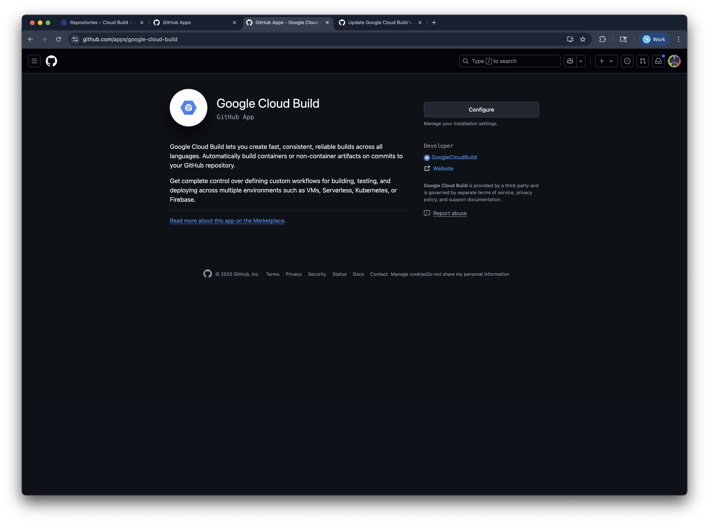

# [DEPRECATED] Setup CI/CD with Google Cloud Build

> [!IMPORTANT]
> This guide is deprecated and kept as a reference.
> 

This document provides instructions for setting up continuous integration and deployment to Google Agent Engine using Cloud Build Triggers and GitHub.

## Overview

The CI/CD pipeline automatically deploys the Agent to Vertex AI Agent Engine whenever changes are merged to the `main` branch. It uses the [existing deployment script](../src/scripts/deploy_agent.py), supports custom agent display names and descriptions, and includes [optional Agentspace registration](../src/scripts/register_agent.py).

This setup provides commands to use with the **`gcloud` CLI** to provision Google Cloud Infrastructure, and uses **Google Cloud Build** to handle the deployment pipeline. It requires [connecting to a GitHub repository using the Cloud Build App](https://cloud.google.com/build/docs/automating-builds/github/connect-repo-github#connect_to_a_github_host_programmatically).

### Pipeline Flow

```
GitHub Push to main → Google Cloud Build Trigger → Deploy to Agent Engine → (Optional) Register with Agentspace
```

### Required APIs

Additional required services outside of those [enabled by default](https://cloud.google.com/service-usage/docs/enabled-service#default) in every new project

| API Title | Service Name | Purpose |
|-----------|--------------|---------|
| Cloud Build API | `cloudbuild.googleapis.com` | CI/CD pipeline execution |
| Secret Manager API | `secretmanager.googleapis.com` | Authentication tokens and sensitive variable substitutions |
| Vertex AI API | `aiplatform.googleapis.com` | Agent deployment and management |
| Telemetry (OTLP) API | `telemetry.googleapis.com` | Collect OTLP trace data |
| Discovery Engine API | `discoveryengine.googleapis.com` | Agentspace registration |

### Cloud Build Service Account IAM Roles

| Role | Role ID | Purpose |
|------|---------|---------|
| Logs Writer | `roles/logging.logWriter` | Write to Cloud Logging |
| Service Account User | `roles/iam.serviceAccountUser` | Manage the Agent Engine attached Service Account
| Storage Admin | `roles/storage.admin` | Cloud Build logs and artifacts |
| Vertex AI User | `roles/aiplatform.user` | Deploy to agent engine |
| Discovery Engine Editor | `roles/discoveryengine.editor` | Register the agent to the Agentspace app |

### Required Environment Variables

The following environment variables must be configured in Cloud Build:

| Variable | Description | Example |
|----------|-------------|---------|
| `_GOOGLE_GENAI_USE_VERTEXAI` | Enable Vertex AI usage (required) | `true` |
| `_GOOGLE_CLOUD_PROJECT` | GCP Project ID | `your-project-id` |
| `_GOOGLE_CLOUD_LOCATION` | Vertex AI location | `us-central1` |
| `_GOOGLE_CLOUD_STORAGE_BUCKET` | Staging bucket for agent files | `your-staging-bucket` |

### Optional Variables

These variables configure optional values, update the deployed Agent Engine instance, and register the instance with an existing Agentspace app. See the [Update Trigger Substitutions](#5-update-trigger-substitutions-after-initial-deployment) section for details on how to set these after the initial deployment.

| Variable | Description | Default | When to Use |
|----------|-------------|---------|-------------|
| `_GCS_DIR_NAME` | Directory name within the staging bucket for agent files | `agent-engine-staging` | To customize the staging directory |
| `_AGENT_DISPLAY_NAME` | Display name for the Agent Engine instance | `""` (defaults to "ADK Agent") | For new deployments or to update the display name |
| `_AGENT_DESCRIPTION` | Description for the Agent Engine instance | `""` (defaults to "ADK Agent") | For new deployments or to update the description |
| `_AGENT_ENGINE_ID` | Existing agent engine ID | `""` (creates new instance) | When updating an existing agent |
| `_LOG_LEVEL` | Application logging verbosity | `INFO` | To adjust logging detail (DEBUG, INFO, WARNING, ERROR) |
| `_OTEL_INSTRUMENTATION_GENAI_CAPTURE_MESSAGE_CONTENT` | Capture LLM message content in traces | `true` | Set to `false` to exclude sensitive content from traces |
| `_AGENTSPACE_APP_ID` | Agentspace application ID | `""` (skips registration) | For Agentspace integration |
| `_AGENTSPACE_APP_LOCATION` | Agentspace resource location | `""` | Required when using Agentspace (`global`, `us`, or `eu`) |

## Setup Instructions

### 1. Set Environment Variables

Export all the required variables to reuse in the `gcloud` commands in this guide.

**Note:** Update the variable values with your actual project details before running the rest of the commands.

```bash
# Required Agent name
export AGENT_NAME="your-agent-name"

# GitHub integration variables
export GITHUB_CONNECTION_NAME="github-connection"
export GITHUB_REPO_NAME="your-repo-name"
export GITHUB_REPO_OWNER="your-github-username-or-organization"
export TRIGGER_NAME="deploy-your-agent-main"
export TRIGGER_BRANCH="main"

### Google Cloud configuration
export GOOGLE_GENAI_USE_VERTEXAI="true"
export GOOGLE_CLOUD_PROJECT="your-project-id"
export GOOGLE_CLOUD_LOCATION="us-central1"
export GOOGLE_CLOUD_STORAGE_BUCKET="your-staging-bucket"
export GCS_DIR_NAME="agent-engine-staging"

### Optional Agent application runtime environment variables
### Logging verbosity (defaults to "INFO" if unset) - must be one of "DEBUG", "INFO", "WARNING", "ERROR", "CRITICAL"
export LOG_LEVEL="INFO" 

# OTel genai event content capture (defaults to "true" if unset) - https://opentelemetry.io/blog/2024/otel-generative-ai/#example-usage
export OTEL_INSTRUMENTATION_GENAI_CAPTURE_MESSAGE_CONTENT="true"

### Optional Environment Variables for Agent Engine Deployment ###
### Display Name and Description default to "ADK Agent" if left unset
export AGENT_DISPLAY_NAME="Your Agent Engine Display Name"
export AGENT_DESCRIPTION="Your Agent Engine Description"

### Leave unset to deploy a new Agent Engine instance or set the value to a deployed instance ID to update it
# export AGENT_ENGINE_ID


### Optional Environment Variables for Agentspace app registration ###
### Leave unset if not using Agentspace or register the Agent Engine instance with this Agentspace App ID
# export AGENTSPACE_APP_ID

### Location only used when registering an Agent Engine instance with an Agentspace App - must be one of "global", "us", or "eu"
# export AGENTSPACE_APP_LOCATION="global"
```

### 2. Configure the Agent Engine service account

The deployment script configures the Agent Engine instance with a service account named using the `AGENT_NAME` environment variable.

#### Create a Service Account
```sh
gcloud iam service-accounts create "${AGENT_NAME}-app" \
  --project=${GOOGLE_CLOUD_PROJECT} \
  --display-name="${AGENT_NAME} App Service Account"
```

#### Grant Required Roles to the Service Account
```sh
ROLES=(
  "roles/aiplatform.user"
  "roles/cloudtrace.agent"
  "roles/logging.logWriter"
  "roles/serviceusage.serviceUsageConsumer"
  "roles/telemetry.tracesWriter"
)
for ROLE in "${ROLES[@]}"; do
  gcloud projects add-iam-policy-binding ${GOOGLE_CLOUD_PROJECT} \
    --member="serviceAccount:${AGENT_NAME}-app@${GOOGLE_CLOUD_PROJECT}.iam.gserviceaccount.com" \
    --role="${ROLE}" \
    --condition=None
done
```

### 3. Configure the Cloud Build Trigger service account

#### Create a Service Account
```sh
gcloud iam service-accounts create "${AGENT_NAME}-cicd" \
  --project=${GOOGLE_CLOUD_PROJECT} \
  --display-name="${AGENT_NAME} CICD Runner Service Account"
```

#### Grant Required Roles to the Service Account
```sh
ROLES=(
  "roles/aiplatform.user"
  "roles/discoveryengine.editor"
  "roles/iam.serviceAccountUser"
  "roles/logging.logWriter"
  "roles/storage.admin"
)
for ROLE in "${ROLES[@]}"; do
  gcloud projects add-iam-policy-binding ${GOOGLE_CLOUD_PROJECT} \
    --member="serviceAccount:${AGENT_NAME}-cicd@${GOOGLE_CLOUD_PROJECT}.iam.gserviceaccount.com" \
    --role="${ROLE}" \
    --condition=None
done
```

### 4. Create Cloud Build Trigger (2nd Generation)

#### Grant the Secret Manager Admin role to the Cloud Build Service Agent
```sh
PROJECT_NUMBER=$(gcloud projects describe ${GOOGLE_CLOUD_PROJECT} --format="value(projectNumber)")
CLOUD_BUILD_SERVICE_AGENT="service-${PROJECT_NUMBER}@gcp-sa-cloudbuild.iam.gserviceaccount.com"
gcloud projects add-iam-policy-binding ${GOOGLE_CLOUD_PROJECT} \
  --member="serviceAccount:${CLOUD_BUILD_SERVICE_AGENT}" \
  --role="roles/secretmanager.admin" \
  --condition=None
```

> [!NOTE]
> You can revoke the Secret Manager Admin role (`roles/secretmanager.admin`) after your connection is in state **COMPLETE**

#### Set up GitHub Connection (One Time Only)

> [!NOTE]
> You may need to configure the [Google Cloud Build GitHub App](https://github.com/apps/google-cloud-build) directly from your browser if the `gcloud` commands don't work.
> 

Create GitHub host connection.
```sh
gcloud builds connections create github ${GITHUB_CONNECTION_NAME} \
  --project=${GOOGLE_CLOUD_PROJECT} \
  --region=${GOOGLE_CLOUD_LOCATION}
```

Follow the browser-based process to install and authorize the Cloud Build GitHub App. Then confirm the installation.
```sh
gcloud builds connections describe ${GITHUB_CONNECTION_NAME} \
  --project=${GOOGLE_CLOUD_PROJECT} \
  --region=${GOOGLE_CLOUD_LOCATION}
```

Create the GitHub repository connection.
```sh
gcloud builds repositories create ${GITHUB_REPO_NAME} \
  --remote-uri="https://github.com/${GITHUB_REPO_OWNER}/${GITHUB_REPO_NAME}.git" \
  --connection="${GITHUB_CONNECTION_NAME}" \
  --project=${GOOGLE_CLOUD_PROJECT} \
  --region="${GOOGLE_CLOUD_LOCATION}"
```

#### Create the Build Trigger

```bash
# Compose the base trigger substitutions
SUBSTITUTIONS="_GOOGLE_GENAI_USE_VERTEXAI=${GOOGLE_GENAI_USE_VERTEXAI}"
SUBSTITUTIONS="${SUBSTITUTIONS},_GOOGLE_CLOUD_PROJECT=${GOOGLE_CLOUD_PROJECT}"
SUBSTITUTIONS="${SUBSTITUTIONS},_GOOGLE_CLOUD_LOCATION=${GOOGLE_CLOUD_LOCATION}"
SUBSTITUTIONS="${SUBSTITUTIONS},_GOOGLE_CLOUD_STORAGE_BUCKET=${GOOGLE_CLOUD_STORAGE_BUCKET}"
SUBSTITUTIONS="${SUBSTITUTIONS},_AGENT_NAME=${AGENT_NAME}"

# Optional substitutions for the Agent Engine instance
if [[ -n "${GCS_DIR_NAME}" ]]; then
  SUBSTITUTIONS="${SUBSTITUTIONS},_GCS_DIR_NAME=${GCS_DIR_NAME}"
fi
if [[ -n "${AGENT_DISPLAY_NAME}" ]]; then
  SUBSTITUTIONS="${SUBSTITUTIONS},_AGENT_DISPLAY_NAME=${AGENT_DISPLAY_NAME}"
fi
if [[ -n "${AGENT_DESCRIPTION}" ]]; then
  SUBSTITUTIONS="${SUBSTITUTIONS},_AGENT_DESCRIPTION=${AGENT_DESCRIPTION}"
fi

# Optional substitution to update an existing Agent Engine instance
if [[ -n "${AGENT_ENGINE_ID}" ]]; then
  SUBSTITUTIONS="${SUBSTITUTIONS},_AGENT_ENGINE_ID=${AGENT_ENGINE_ID}"
fi

# Optional substitutions for Agent application runtime environment variables
if [[ -n "${LOG_LEVEL}" ]]; then
  SUBSTITUTIONS="${SUBSTITUTIONS},_LOG_LEVEL=${LOG_LEVEL}"
fi
if [[ -n "${OTEL_INSTRUMENTATION_GENAI_CAPTURE_MESSAGE_CONTENT}" ]]; then
  SUBSTITUTIONS="${SUBSTITUTIONS},_OTEL_INSTRUMENTATION_GENAI_CAPTURE_MESSAGE_CONTENT=${OTEL_INSTRUMENTATION_GENAI_CAPTURE_MESSAGE_CONTENT}"
fi

# Optional substitutions for Agentspace registration
if [[ -n "${AGENTSPACE_APP_ID}" ]]; then
  SUBSTITUTIONS="${SUBSTITUTIONS},_AGENTSPACE_APP_ID=${AGENTSPACE_APP_ID}"
  SUBSTITUTIONS="${SUBSTITUTIONS},_AGENTSPACE_APP_LOCATION=${AGENTSPACE_APP_LOCATION}"
fi

# Create 2nd generation trigger for main branch merges
gcloud builds triggers create github \
  --name="${TRIGGER_NAME}" \
  --region="${GOOGLE_CLOUD_LOCATION}" \
  --repository="projects/${GOOGLE_CLOUD_PROJECT}/locations/${GOOGLE_CLOUD_LOCATION}/connections/${GITHUB_CONNECTION_NAME}/repositories/${GITHUB_REPO_NAME}" \
  --branch-pattern="^${TRIGGER_BRANCH}\$" \
  --build-config="cloudbuild.yaml" \
  --service-account="projects/${GOOGLE_CLOUD_PROJECT}/serviceAccounts/${TRIGGER_SERVICE_ACCOUNT_NAME}@${GOOGLE_CLOUD_PROJECT}.iam.gserviceaccount.com" \
  --substitutions=${SUBSTITUTIONS}
```

**Note:** Make sure you've exported the environment variables from Step 1 before running these commands. The GitHub connection setup is only needed once per project.


### 5. Test the Pipeline

```bash
# Trigger a manual build to test
gcloud builds triggers run "${TRIGGER_NAME}" --region=${GOOGLE_CLOUD_LOCATION} --branch=${TRIGGER_BRANCH}
```

### 6. Update Trigger Substitutions After Initial Deployment

Once resources are deployed, add build environment substitutions to update an existing Agent Engine instance and register it with an Agentspace App.

1. Open the **Triggers** page in the Google Cloud console
2. Open the Build triggers page
3. In the toolbar of the Google Cloud console, select your Google Cloud project
4. Locate the row with the trigger you would like to update
5. Click the menu (vertical ellipses) located at the right end of the row
6. Select Edit
7. Under Advanced > Substitution variables, click + Add variable at the bottom of the existing list to add the update and registration variables:
  - `_AGENT_ENGINE_ID`: get this from the build logs or under Vertex AI > Agent Engine in the Cloud Console for the deployed Agent Engine instance
  - `_AGENTSPACE_APP_ID`: get this from the Cloud Console AI Applications > Apps - find your Agentspace app ID
  - `_AGENTSPACE_APP_LOCATION`: your Agentspace app resource location - `global`, `us`, or `eu`


## Pipeline Stages

The CI/CD pipeline defined in [cloudbuild.yaml](../cloudbuild.yaml) consists of the following stages:

1. **Install Dependencies** - Installs project dependencies using `uv`
2. **Build a Wheel** - Builds a wheel file from the source code
3. **Deploy to Agent Engine** - Creates/updates the Vertex AI Agent Engine instance
4. **Register with Agentspace** - (Optional) Registers the Agent Engine instance with Agentspace

## Monitoring and Troubleshooting

### View Build History

```bash
# Find the ID from the list active builds
gcloud builds list --region=${GOOGLE_CLOUD_LOCATION} --ongoing --format='table(createTime,status,id)'

# View specific build logs by Build ID
gcloud builds log <BUILD_ID> --region=${GOOGLE_CLOUD_LOCATION} --stream

# One-liner to stream the latest active build logs
gcloud builds log $(gcloud builds list --region=${GOOGLE_CLOUD_LOCATION} --ongoing --limit=1 --format='value(id)') --region=${GOOGLE_CLOUD_LOCATION} --stream
```

## Resources
- [Cloud Build | Connect to a GitHub repository (2nd generation)](https://cloud.google.com/build/docs/automating-builds/github/connect-repo-github?generation=2nd-gen)
- [Cloud Build | Create and manage build triggers - Update a build trigger](https://cloud.google.com/build/docs/automating-builds/create-manage-triggers#update_a_build_trigger)
- [Vertex AI | Agent Engine | Deploy an Agent](https://cloud.google.com/vertex-ai/generative-ai/docs/agent-engine/deploy)

**[← Back to Documentation](../README.md#documentation)**
