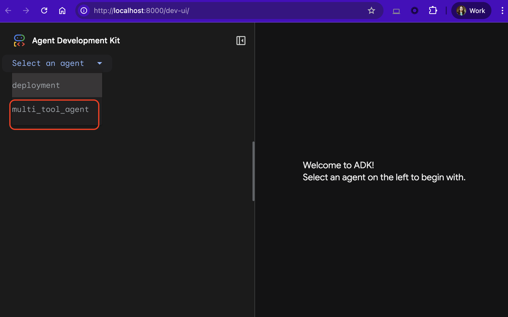

# Development Guide

This guide covers all development commands and workflows for building and testing agents locally.

## Environment Setup

### Install Dependencies

```bash
# Install all dependencies including dev group
uv sync --all-extras

# Add new dependencies
uv add package-name          # Runtime dependency
uv add package-name --dev    # Development dependency

# Update all dependencies
uv lock --upgrade
```

### Environment Configuration

**📖 [Complete Environment Variables Reference](environment_variables.md)** - Comprehensive guide to all configuration options

```bash
# Copy environment template
cp .env.example .env

# Edit .env with your values
# Required: AGENT_NAME, GOOGLE_CLOUD_PROJECT, GOOGLE_CLOUD_LOCATION, GOOGLE_GENAI_USE_VERTEXAI=true
```

## Running Agents Locally

### Recommended: Full Observability

```bash
uv run local-agent
```

This script provides:
- Full OpenTelemetry instrumentation
- Cloud Trace export
- Structured logging with trace correlation
- Web interface at `http://localhost:8000`

> [!NOTE]
> The `deployment` directory will show as an agent available for selection. You can ignore it.



### Alternative: Built-in ADK Web UI

```bash
uv run adk web src
```

Basic observability with ADK's native web interface at `http://localhost:8000`

### Terminal Mode

```bash
uv run adk run src/agent
```

Interactive terminal-based agent testing.

## Code Quality

### Automated Checks

**All PRs automatically run:**
- Ruff formatting and linting
- MyPy type checking
- Claude Code AI reviews

### Manual Quality Commands

```bash
# Format code
uv run ruff format

# Lint code
uv run ruff check

# Type checking
uv run mypy

# Run all checks at once (recommended before creating PRs)
uv run ruff format && uv run ruff check && uv run mypy
```

**Important**: Always run these commands locally before creating pull requests to ensure automated checks pass.

### Unit Testing

The repository includes comprehensive unit tests for the deployment configuration module with 100% code coverage requirement.

```bash
# Run all tests
uv run pytest

# Run specific test file
uv run pytest tests/test_config.py

# Run specific test class
uv run pytest tests/test_config.py::TestDeployEnv

# Run specific test function
uv run pytest tests/test_config.py::TestDeployEnv::test_valid_deploy_env_creation

# Run tests with coverage report (100% required for config module)
uv run pytest --cov
```

**Test Organization:**
- **tests/test_config.py**: Comprehensive tests for all Pydantic config models
- **tests/conftest.py**: Reusable pytest fixtures

**Key Fixtures:**
- **Environment Data**: `valid_base_env`, `valid_deploy_env`, `valid_delete_env`, etc. - Pre-configured test data
- **Mock Helpers**: `mock_load_dotenv`, `mock_sys_exit`, `set_environment`, `mock_print_config` - Eliminate repetitive patching
- **Test Isolation**: `clean_environment` - Auto-cleanup between tests

**Key Testing Patterns:**
- DRY fixture pattern eliminates ~50 lines of boilerplate code
- Type-safe fixtures with precise type hints for IDE support
- Fixture composition for complex test scenarios
- Coverage configured to require 100% for `src/{package_name}/deployment/config.py`

## Manual Deployment

> [!WARNING]
> **Manual deployment without CI/CD setup requires additional configuration.**
>
> For the smoothest experience, complete the automated CI/CD setup first.
> This ensures all required service accounts and APIs are configured correctly.
>
> Required APIs: see [services.tf](../terraform/services.tf)
> Required App Service account and IAM roles: see [iam.tf](../terraform/iam.tf)

### Prerequisites

Ensure your `.env` file contains all required deployment variables (see [Environment Variables Reference](environment_variables.md)).

### Testing Deployment Configuration

```bash
# Test deployment environment setup
uv run test-deploy

# Test Agentspace registration environment setup
uv run test-register
```

These commands validate that all required environment variables are set correctly without actually deploying or registering.

### Manual Deployment Commands

```bash
# Build package
uv build --wheel --out-dir .

# Deploy to Vertex AI Agent Engine
uv run deploy

# Interact with the deployed agent
uv run remote-agent

# Optional: Register with Agentspace (requires AGENTSPACE_APP_ID)
uv run register

# List all agents registered with the Agentspace app
uv run list-agents
```

### Cleanup Commands

```bash
# Delete Agent Engine instance (requires AGENT_ENGINE_ID)
uv run delete

# Unregister from Agentspace (requires confirmation)
uv run unregister
```

## Development Workflow

1. **Make changes** to agent code and prompts
2. **Test locally** with `uv run local-agent`
3. **Run quality checks** with ruff and mypy
4. **Create PR** - automated checks will run
5. **Deploy** via CI/CD or manual deployment


## Resources

**[← Back to Documentation](../README.md#documentation)**
